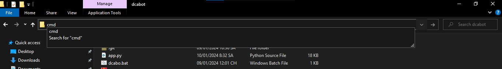
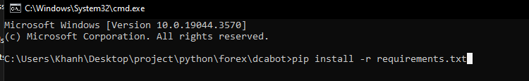

# Cài đặt tool DCA bot Mt5

1. Cài python 3.10.7 ( Đánh dấu vào ô Add python 3.10 to PATH) 
2_1. Cài thư viện python: tại thư mục chưa tool click vào dòng địa chỉ nhập "cmd" 
2_2. Nhập "pip install -r requirements.txt" 
2_3. Nếu không chạy nhập lần lượt các lệnh: "pip install MetaTrader5" và "pip install tkinter"
3. Chạy file dcabo.bat
