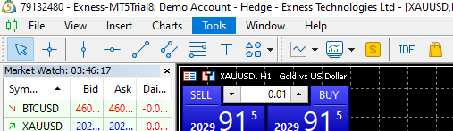
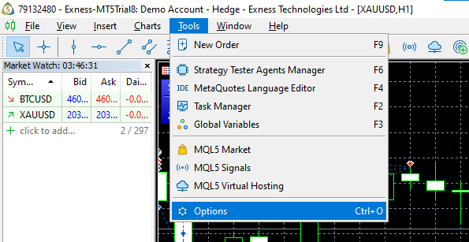
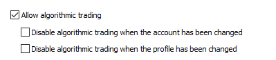

# Tính năng

```sh
    1. Đặt hàng loạt lệnh pending với các thông số nhập vào
    2. Xoá các lệnh cũ trước khi đặt
    3. Thay đổi TP của vị thế khớp mới nhất
    4. Thay đổi TP của các vị thế khác theo vị thế khớp mới nhất
    5. Đóng tất cả các lệnh nếu có vị thế hit TP/SL
    6. Đóng tất cả lệnh nếu đạt đến số lãi/lỗ nhất định
    7. Chọn client Mt5 muốn đặt lệnh
    8. Sửa SL/TP tất cả các lệnh theo số nhập vào
    9. Chạy nhiều client 1 lúc (continue...)
```

# Cài đặt tool DCA bot Mt5

```sh
    1. Cài python 3.10.7 ( Đánh dấu vào ô Add python 3.10 to PATH) 
    2_1. Cài thư viện python: tại thư mục chưa tool click vào dòng địa chỉ nhập "cmd" 
    2_2. Nhập "pip install -r requirements.txt" 
    2_3. Nếu không chạy nhập lần lượt các lệnh: "pip install MetaTrader5" và "pip install tk"
    3. Chạy file dcabo.bat
    4. Bật chế độ cho phép chạy auto trên client Mt5
    4_1. Chọn Tool 
    4_2. Chọn Options 
    4_3. Chọn One Click Trading ở Tab Trade 
    4_4. Chọn Allow algothimic trading và bỏ chọn các ô Disable 
```